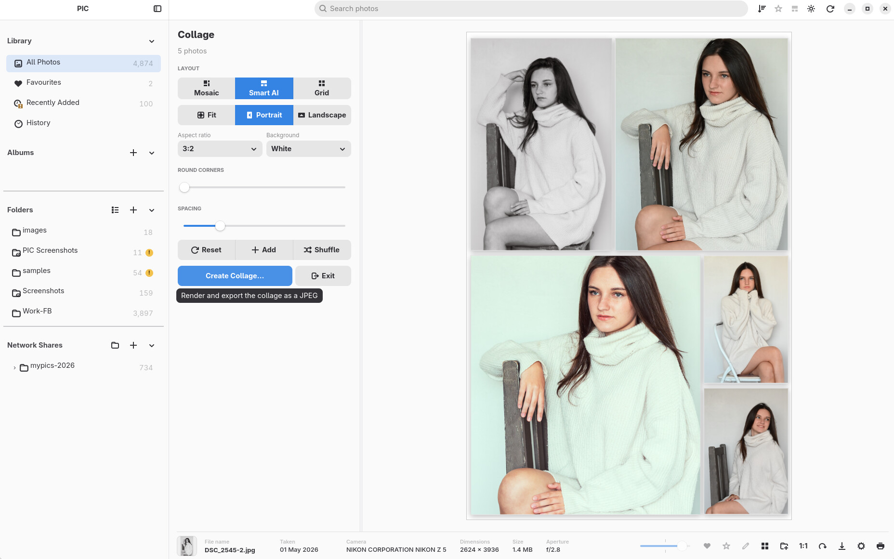

# PIC — Personal Image Catalogue

*Inspired by Picasa and classic iPhoto.*

**Browse, organise, view and edit your photos on Linux — in the folders you already use.**

[GitHub repository](https://github.com/froggy744/PIC) · [Getting started](docs/guides/getting-started.md) · [Build and install](docs/build/linux.md) · [RC3 release notes](docs/releases/rc3.md)


PIC is a local-first photo manager built with Rust, GTK4 and libadwaita. It brings together a fast photo library, folder and network browsing, ratings, albums, a large-photo viewer, practical editing, collages and printing.

Your originals remain in their existing folders. Importing indexes them rather than moving or copying them; albums, ratings and editing recipes are stored in PIC's local library. Edited images are exported as new files.

## What's current in RC3

- **Photo Wall** fills rows with photos in their natural proportions, alongside the regular thumbnail grid.
- **Folder browsing** uses virtualised sections with folder headings, smoother resizing and restored selection and scroll positions.
- **Five-star ratings** work on individual photos or selections, with rating filters and sorting.
- **Multiple library databases**, database backups and a History view help keep collections organised.
- **Shared zoom controls** resize thumbnails, zoom the viewer and adjust the editor. Native-resolution viewing loads higher-quality pixels when needed.
- **Progressive imports and network browsing** keep large local, SMB and NFS collections usable while work continues in the background.
- **JPEG colour management** converts valid embedded ICC profiles, including ProPhoto RGB and Adobe RGB, to sRGB for thumbnails and the viewer. JPEGs without profiles keep the existing sRGB path; malformed profiles fall back safely.

See the [RC3 release notes](docs/releases/rc3.md) for the wider changes since RC2.

## Your library, your folders

Use **All Photos**, **Favourites**, **Recently Added** and **History** to explore your collection. Create albums without duplicating files, or browse the real folder tree in the sidebar. Search photo and folder names, then open a matching folder directly from the suggestions.


Folder sections show where photos belong while keeping only the necessary tiles active. Thumbnail generation runs in the background and cached previews speed up return visits. Disconnected storage stays represented in the library with availability markers; opening or exporting the original requires that storage to be reachable.

Right-click a folder to refresh it, change whether it is watched, see statistics or remove it from the library. Removing its catalogue entry does not delete its original photos.


## Grid or Photo Wall

Choose the regular grid for consistent thumbnail sizes, or use the view toggle in the bottom bar to switch to **Photo Wall**. Its rows preserve photo proportions, making mixed portrait and landscape collections easier to enjoy.


Use the bottom zoom slider or **Ctrl + mouse wheel** to change thumbnail size. Hide the sidebar when you want more room for the photos.


In **Settings → Interface**, choose filename visibility, portrait-thumbnail behavior and optional **High quality thumbnails (640 px)** for Photo Wall on high-DPI displays. Normal thumbnails remain 320 px. Higher-quality previews are generated as needed; enabling the option does not require a synchronous rebuild of the entire library.

## View the details

Select a photo to see its name, date, camera, dimensions and file size in the bottom bar. Open it with a double-click, Enter or Space. Move through the current collection with the arrow keys or mouse wheel, switch between fit and **1:1** with Space, zoom with the slider or **Ctrl + wheel**, and drag to pan when zoomed in.

The viewer starts with a preview and loads higher-quality image data in the background. Native-resolution decoding is used for close inspection rather than simply enlarging a fit-to-window preview. Closing the viewer returns you to your selected photo.


Embedded JPEG ICC profiles are applied before resizing or display, so colour-managed JPEG thumbnails and viewer images share the same sRGB conversion. This applies to local and network JPEGs. EXIF orientation is preserved. The change does not extend ICC management to every supported image format.

## Favourites, albums and ratings

Heart a photo to put it in **Favourites**. Create an album for a trip, project or collection; the same photo can belong to several albums without additional copies.

Use the star control to give a photo **1–5 stars**, or rate the current selection with the number keys. **0** clears the rating. The toolbar's rating filter offers unrated photos, all starred photos or a particular star level, and the sort menu includes Rating.


Ratings are stored in PIC's database and do not rewrite the image file. **Settings → Database** lets you create, open, rename, back up and restore separate libraries. Database backups contain catalogue metadata; back up your photo folders separately.

## Practical, non-destructive editing

Open **Edit Mode** from the pencil button or a photo's context menu. Use the five tabs — **Tools, Filters, Crop, Overlays and Text** — for everyday changes:

- Auto Contrast, Auto Colour, black and white, and sepia.
- Exposure, contrast, fill light, highlights, shadows, saturation, warmth and sharpening.
- Live filter previews rendered from your photo.
- Free or fixed-ratio crops, a composition grid and horizon straightening.
- Image overlays and styled text with placement, size and opacity controls.
- Undo, redo, reset, and copy/paste of edits between photos.

<a href="screenshots/edit-mode.mp4"></a>

[Watch Edit Mode in action (MP4, about 1 minute)](screenshots/edit-mode.mp4).

Edits are saved as recipes. Export renders a new image with the changes applied, leaving the source file intact. PIC is intended for practical photo adjustments; it is not a full professional RAW development suite.

## Collages and printing

Select several photos to create a **Grid, Mosaic or Smart Mosaic** collage. Adjust the arrangement, spacing, background and overall shape; shuffle, undo and redo; save a project to resume later; then export a high-resolution image.



Print one or several photos with a page preview, paper size and orientation, fit or crop options, and per-page layouts.

## Local drives and network shares

Import folders from your computer, removable storage or the in-app **Browse Network Photos** dialog. PIC can discover and browse **SMB and NFS** shares with tree navigation, or open a supplied share URL. Registered shares appear in the sidebar.


The Linux packages include direct SMB and NFS transports; a manually mounted share is also usable as a normal folder. Server availability and permissions still determine which originals can be read. See the [Folders guide](docs/guides/folders.md) and [portable NFS guide](docs/build/portable-nfs.md).

## Make PIC comfortable

Choose a theme in Settings, hide or reveal the sidebar, and adjust thumbnail presentation. The layout adapts as the window narrows, keeping more space available for photos.


## Supported formats

**Standard images:** JPEG, PNG, WebP, GIF, BMP, TIFF, AVIF and HEIC/HEIF.

**Camera RAW:** NEF, NRW, CR2, CR3, ARW, DNG, RAF, ORF, RW2, PEF, SRW and RAW. Where available, PIC uses embedded camera previews for faster browsing. RAW support here is not a promise of full sensor-data development.

Choose the visible formats in Settings. JPEG ICC conversion covers standalone JPEG decoding for thumbnails and viewing; other formats retain their existing colour behavior.

## Keyboard and mouse

| Where | Action | Control |
| --- | --- | --- |
| Grid | Move selection | Arrow keys |
| Grid | Open selected photo | Enter or Space |
| Grid | Resize thumbnails | Bottom zoom slider or Ctrl + wheel |
| Grid | Select several photos | Ctrl + click |
| Grid | Select all / clear selection | Ctrl+A / Ctrl+D; Folder view scopes selection to the active folder |
| Grid / viewer | Rate / clear rating | 1–5 / 0, outside text fields |
| Grid / viewer | Photo actions | Right-click |
| Viewer | Previous / next | Left / Right or mouse wheel |
| Viewer | Toggle fit / 1:1 | Space or the 1:1 control |
| Viewer | Zoom | Bottom zoom slider, + / −, or Ctrl + wheel |
| Viewer | Pan when zoomed in | Click and drag |
| Viewer | Close | Esc or double-click |
| Window | Toggle full screen | F11 |
| Search | Open a selected folder suggestion | Enter |
| Search | Clear search | Esc |

Use Space or the 1:1 control for viewer magnification: the number keys are used for photo ratings.

## User guides

Start with [Getting started](docs/guides/getting-started.md), then use the focused guides:

1. [Navigation](docs/guides/navigation.md) — the window, viewer, zoom and shortcuts.
2. [Folders](docs/guides/folders.md) — local folders, watched folders, network shares and offline storage.
3. [Library](docs/guides/library.md) — layouts, ratings, albums, search and databases.
4. [Edit Mode](docs/guides/edit-mode.md) — adjustments, filters, overlays, text and export.
5. [Crop Mode](docs/guides/crop-mode.md) — framing, aspect ratios and straightening.

## Install and run

**Flatpak is the primary Linux package.** The [Linux build guide](docs/build/linux.md) covers dependencies, installation, optional AppImage builds and troubleshooting.

From the repository root, build the current checkout:

```sh
./scripts/PIC-build-linux-one-script.sh local --flatpak-only
```

Install the generated bundle, replacing `REVISION` with its actual filename:

```sh
flatpak install --user --reinstall ./dist/PIC-1.0.0-REVISION-x86_64.flatpak
flatpak run io.github.you.PicRs
```

For native development, after installing the required build dependencies:

```sh
cargo run --release
```

Windows support is experimental; Linux is the primary development and packaging target.

## Project and support

PIC is release-candidate software under active development. Report problems through [GitHub Issues](https://github.com/froggy744/PIC/issues), including the action that failed, your distribution, the type of storage and relevant logs. Keep backups of both important originals and catalogue data.

PIC is an independent open-source project, not affiliated with, sponsored by or endorsed by Google or Apple.

- [Release Candidate 3](docs/releases/rc3.md) · [Release Candidate 2](docs/releases/rc2.md)
- [Linux builds and installation](docs/build/linux.md) · [Portable NFS](docs/build/portable-nfs.md)
- [Themes](docs/THEMES.md) · [Theme template](docs/theme-template/README.md)
- [Development overview](docs/development/summary.md) · [Gallery architecture history](docs/GALLERY_V2.md)
